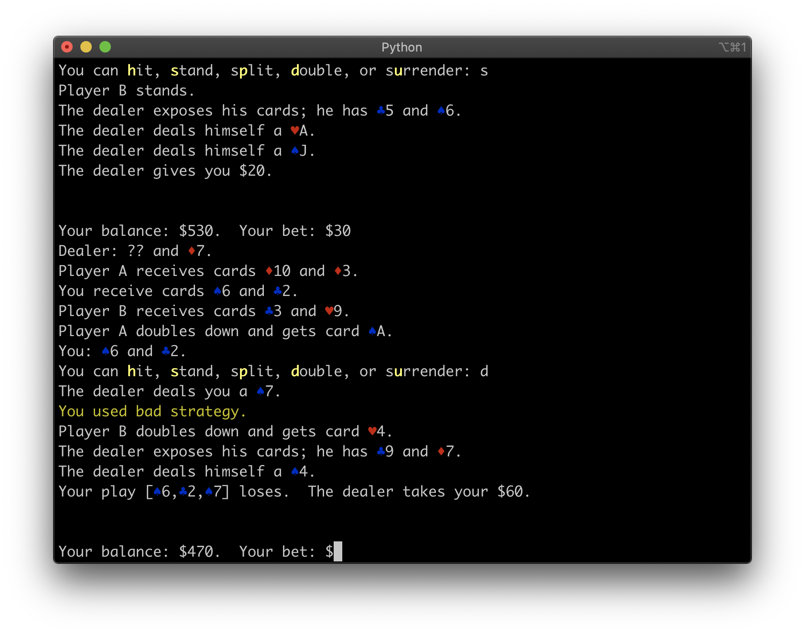

Have you ever wanted to be a Las Vegas high roller?
===================================================

Look no further than Benevolent Blackjack, your pocket pal that'll guide you to untold riches.

Benevolent Blackjack is a cross-platform console-based program that plays a game of Blackjack with you, acting as the dealer and (optionally) any number of co-players.
In addition to being able to play the role of an apathetic dealer, Benevolent Blackjack has two unique features: it can benevolently advise you on whether you are [making optimal decisions](https://en.wikipedia.org/wiki/Blackjack#Basic_strategy) to minimize the house edge, and it can train you to count cards.

Once you become a master at winning Blackjack with this program, all that's left is to charter a private airplane to McCarran International Airport!

Features
========

* BBJ supports a configurable number of artificial co-players at your table.
* BBJ has flexible table rules.  It can enforce rules about a table minimum and maximum, doubling down, surrender, doubling after split, and hitting split Aces.  You can configure the number of decks, the Blackjack payout ratio, whether the dealer hits on soft 17, and whether Five-Card Charlie is enabled.
* BBJ supports insurance.
* BBJ supports simple peaceful gameplay, without worrying about making optimal decisions.
* BBJ can advise you when you fail to follow basic strategy.
* BBJ can train you to count cards accurately.
* BBJ is cross-platform, thanks to Python.  That said, terminal coloring (optional) has OS-specific codepaths.  I tested the latest version only on macOS.
* BBJ is console-based.  This has many advantages.  BBJ does not rely on any graphical toolkit, any window system, or even on having a mouse.  It can be played over Telnet or SSH.
* BBJ uses terminal colors.  You can set coloring suitable for a dark background, suitable for a light background, or disable coloring.

Installing and running
======================

I wish all operating systems would bundle Benevolent Blackjack, but for now this program is a diamond in the rough.
You can install it manually.

This package uses Python 3 and setuptools.

To install:

    python setup.py install

Then run like so for regular peaceful gameplay:

    bbj

Or, to be told when you made a bad move:

    bbj --benevolent

For more options, see `bbj --help`.

Developing
==========

Did you win big, retire, and want to dabble in software development from your new Florida estate?
Be my guest and make some contributions.

This software was developed without any unit tests; I am sorry about that.
At the time I wrote it, I was in college and had never written a single unit test.
All testing was passionately manual.

The software almost certainly does not follow best Python practices, too.
All improvements are very welcome!

The documentation for Benevolent Blackjack is in several places:

* the doc/ directory
* the manpage;
* the source code is reasonably well commented.

Thanks
======

Thanks to Andreas Schagerer for extensively testing the program, reporting many issues, and suggesting new features.
  
TODO
====

* Implement the option of using a continuous shuffler.
* Separate the UI from the Blackjack 'engine'.
* Add unit tests
* Rewrite peafowlterm to not reinvent the linked list
* Make imports more consistent and coherent (`bbj.BJSeqOutcome.BJSeqOutcome` etc.)

Lastly
======

If you win money thanks to Benevolent Blackjack, I accept donations of cash, stock, and real estate.